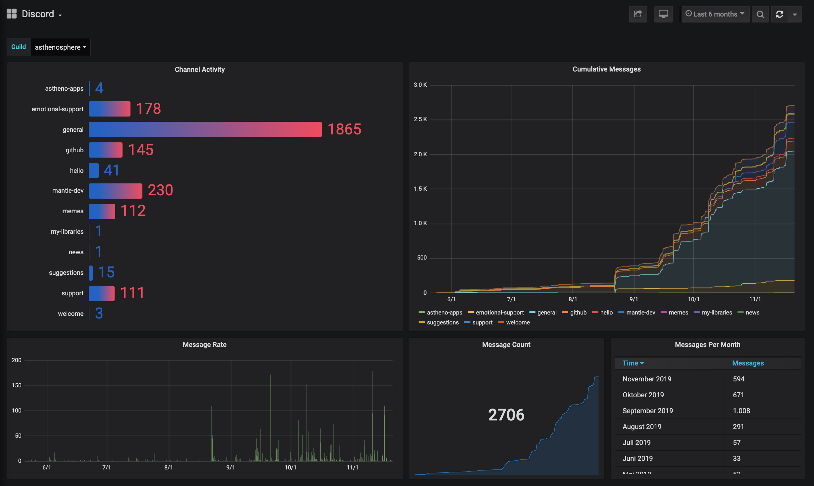

# Discord InfluxDB exporter

Simple metrics exporter for Discord guilds, fully async using tokio-0.2.

__Usage__

 - Build it: `cargo build --release` => `target/release/discord-influx`
 - Head to the [Discord Developer Portal](https://discordapp.com/developers/applications/).
 - Setup a bot with access to the message history and invite it to your guild.
 - Export `DISCORD_TOKEN` to `Bot xxx`.
 - Initial run: `/discord-influx stream guild-name/123456 -s 0`
   (replace `guild-name` with the persistent name in Influx and `123456` with your Guild ID)
 - Subsequent runs: Same as above, but without `-s 0`.
 - Connect to Grafana using https://grafana.com/grafana/dashboards/11240/
